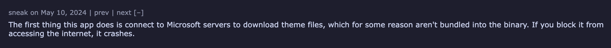

This article mainly uses my experience from superfile to explain some lesser-known knowledge and conventions you might want to know if you're thinking of building a TUI or CLI app. It can help you avoid some unnecessary detours when making these apps.

# TUI and CLI

## TUI (Terminal User Interfaces)

A TUI is basically a user interface you build inside the terminal that looks like the usual UI you use daily, allowing users to control your app. The UI here generally uses text combined with colors.

For operations, you can use keyboard arrow keys or certain shortcuts to trigger features. Some more modern TUI programs even support mouse input.

For example, the superfile app I made is a standard TUI app that lets you manage files through a UI inside the terminal. Also, well-known software like Vim is a TUI.


## CLI (Command-Line Interface)

CLI is a very early interaction method (from a time when computers couldn't show graphical interfaces). CLI interaction is done by typing commands, without the ability to use arrow keys like in a UI.

Commands usually consist of a command and options, and sometimes the command itself includes sub-commands or values.

For example:
```bash
docker run -d -p 8080:80 --name my-nginx nginx
````

Here:

* `docker` is the program name
* `run` is the command
* `-d`, `-p 8080:80`, `--name my-nginx` are options
* `nginx` is the value passed to the command

Below is an example of docker (using podman as a demo):


# Knowledge About TUI, CLI, or Apps in General

This section mainly covers some common but rarely mentioned small facts about TUI or CLI apps. While not critically important, if you want your app to look like a serious software, I still recommend reading it. Otherwise, you might get roasted by people on HackerNews like I did :/



## Default Folders (General)

No matter if you're writing a CLI, TUI, or other types of apps, this is common knowledge.

Every system has a dedicated place to store config files and log files, and you can't just put them anywhere you want. On Linux, the XDG specification is the standard (it's complex but best for user management). CLI or TUI programs should basically follow this.

macOS and Windows have looser rules. The table below gives you a quick reference:

| Purpose    | Linux                            | macOS                                           | Windows                          |
| ---------- | -------------------------------- | ----------------------------------------------- | -------------------------------- |
| **Data**   | `~/.local/share/{your_app_name}` | `~/Library/Application Support/{your_app_name}` | `%LOCALAPPDATA%\{your_app_name}` |
| **Log**    | `~/.local/state/{your_app_name}` | `~/Library/Application Support/{your_app_name}` | `%LOCALAPPDATA%\{your_app_name}` |
| **Config** | `~/.config/{your_app_name}`      | `~/Library/Application Support/{your_app_name}` | `%LOCALAPPDATA%\{your_app_name}` |

## Network Issues (CLI/TUI)

This is mostly something you meet when working on Linux/Unix or more niche fields, but I suggest even if you’re not in this area, you should check it out.

Basically, your program should avoid connecting to the internet unless absolutely necessary. If it must connect, it’s best to provide a setting for users to disable it.

Most CLI/TUI tools don’t need the internet unless you’re building something like curl, which is network-oriented.

For example, my superfile is a file manager and theoretically shouldn’t use the internet, but since it has an auto-update feature, I added a setting so users can control it. The ideal approach is to pop up a prompt asking users whether to enable auto-update.

## Release Versioning (General)

After finishing your app, you might start promoting and releasing it for others to use. At this point, you need to set the version number.

You might be tempted to just pick a random number, but version numbers are not just for looks. Package managers (Homebrew, apt, snap, dnf, etc.) parse them. If you set them arbitrarily, you might end up with issues like I did with superfile using `1.1.7.1`, causing some users not to get updates (see below).

So it’s recommended to always follow [Semantic Versioning](https://semver.org) unless you have special reasons. Of course, some languages or platforms have their own version format, in which case just use that.


# TUI-Related Stuff

## How Terminal Control Works

When we want to control terminal display from an app, we use **ANSI escape sequences**.

For example:

* Fullscreen mode: `\033[?1049h`
* Change text color: `\033[31m`

With these, we can change the terminal appearance.

To detect keyboard input from users, you need to use `raw mode`. For example, pressing `A` sends `0x41` to the app.

## Graph Protocol

You might have seen programs that display images in the terminal. These usually use something called the Graph Protocol.

Here are some major protocols supported by many terminals (some terminals support multiple protocols):

| Protocol Name            | Supported Terminals          |
| ------------------------ | ---------------------------- |
| Kitty Graphics Protocol  | Kitty, WezTerm               |
| Sixel                    | xterm, mlterm, foot, WezTerm |
| iTerm2 Inline Images     | iTerm2                       |
| Terminology Inline Media | Terminology                  |
