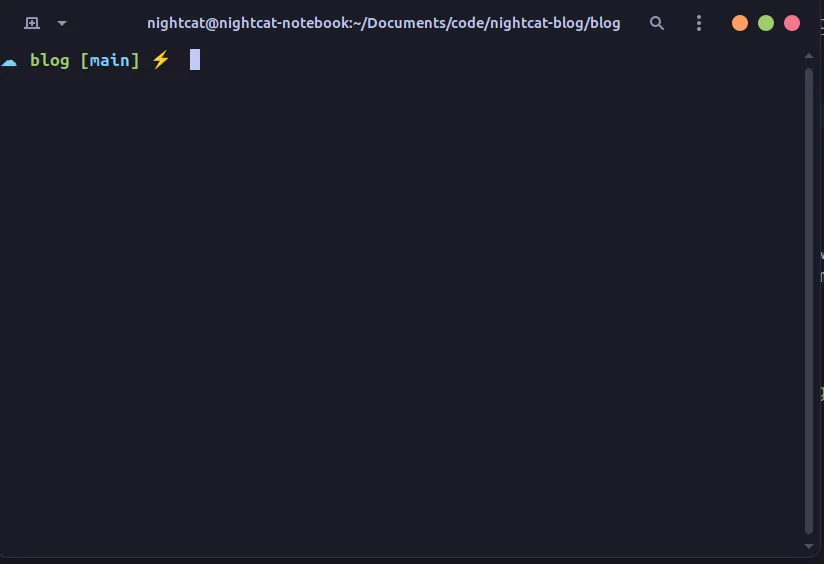

<Alert type="info">
Because this article is very old, and i can't find the original image, so some image are missing.
</Alert>

If you wish to have a very stylish terminal like this:

Then this article will be perfect for you!

## Introduction

- The system is running Ubuntu 22.10, theoretically should work similarly on other systems.
- Demonstrations are done using VirtualBox.
- If you have already run this command due to installing other software, you can skip to Step 2.
- If you encounter errors, you can check the troubleshooting section at the bottom.

# Installing Zsh and Customizing Oh My Zsh

## Step 1: Update the Entire System

> If you have already executed this command due to installing other software, you can directly proceed to Step 2.

Update the system packages to keep the software up to date by entering the following command:

```bash
sudo apt install
```

You should see something similar to this upon completion:


## Step 2: Install Zsh

Install Zsh on your Ubuntu system.

```bash
sudo apt install zsh
```

If prompted with (y/n), simply type y and press enter.

### Verify Zsh Installation

To check if Zsh is installed correctly, enter:

```bash
zsh --version
```


## Step 3: Install Curl and Git

To be able to fetch the installation files for Oh My Zsh, you need to first install curl and git. To install curl and git, enter the following command:

```bash
sudo apt install curl git
```

## Step 4: Install Oh My Zsh

Oh My Zsh is a package that enhances Zsh for a better appearance. Enter the following command to install it:

```bash
sh -c "$(curl -fsSL https://raw.githubusercontent.com/ohmyzsh/ohmyzsh/master/tools/install.sh)"
```

When prompted, press y.

If the installation is successful, you should see the following:


## Step 5: Customize Your Zsh

Now that you have successfully installed Zsh, you can start customizing!

[**You can find the official list of Oh My Zsh themes here**](https://github.com/ohmyzsh/ohmyzsh/wiki/Themes)

> You can also find unofficial themes, but installation is more complex. We won't cover it in this article.

Once you have found a theme you like, note down its name. For example, if I like this one, I'll remember "cloud".


Next, enter the following command:

```bash
nano ~/.zshrc
```

You will see a somewhat intimidating screen, but it's not difficult!


First, find ZSH_THEME="rubbyrussell" and replace it with the name of your desired theme.

Using the cloud theme as an example, it would be:

`ZSH_THEME="cloud"`

Once you've made the change, press `ctrl+x` + `y` + `enter` to save!

To reload Zsh, you can enter:

```bash
source ~/.zshrc
```

After completion, you should see it adapted to your chosen theme!

# Terminal Color Themes

## Step 6: Install Necessary Packages

You can now start customizing your colors. Here, we suggest using pre-adjusted themes by others.

> [We will use this theme package here](https://github.com/Gogh-Co/Gogh)

To install the necessary packages, enter the following command:

```bash
sudo apt-get install dconf-cli uuid-runtime
```

## Step 7: Install Theme Package

To install the theme package, enter:

```bash
bash -c "$(wget -qO- https://git.io/vQgMr)"
```

It will display various symbols and English, where one symbol and English represent one theme. You can search online for the name of the theme you want or explore on your own.

Assuming I want to use "Tokyo Night" as my theme:


Then I'll enter `230` (as shown in the image):


Then press `enter`.

> If you encounter this error, please see troubleshooting below. 

## Step 8: Apply the Theme

First, right-click on the terminal and click `Preferences`.


Then click `Set as default` next to the name of the theme you just selected.


Close the terminal and open it again to see the theme in effect.

But you may notice that the Zsh theme is missing. This is because Zsh is not your default shell. You can see how to set it as the default shell in the next section.


## Step 9: Set Zsh as the Default

First, go to Preferences, and click on the theme you just set.


Then click on `command` at the top, check `Run a custom command instead of my shell`, and enter zsh in the input field below (as seen in the image below).


# Conclusion

That's it! You've now configured your GNOME terminal theme!

To achieve the look of the image at the beginning, you'll need to set up a GNOME theme (might write an article on that in the future!).

# Troubleshooting

## Error Occurs When Installing Theme Package

Right-click on the terminal and click on Preferences.


Open the window and click on the `+` next to `Profiles` and enter `Default` (without changing anything).


After completion, repeat Step 7.
