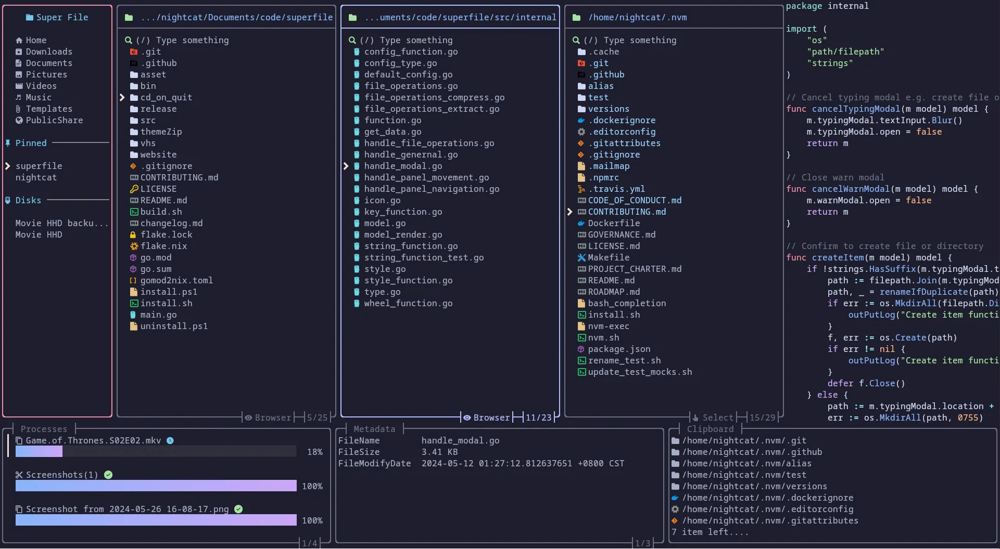
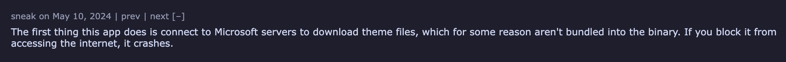

這篇文章主要會以我 superfile 中的經驗，來講解一下如果想要做一個 TUI 或者 CLI APP 你可能會需要知道的一些冷門知識以及規範。

## TUI 以及 CLI

### TUI (terminal user interfaces)
TUI 簡單來說就是在 Terminal 上做出一個簡單的類似你平常使用的使用者介面來讓使用者可以做到控制你的 APP。這邊指的 使用者介面一般都是以文字配合顏色來做到。

而再操作部分你可以使用鍵盤上的上下左右，或者某個快捷鍵等來去做到某個功能，有些較為現代的 TUI 程式還會支援滑鼠的操作。

比方說下面這個是我做的 superfile APP，他就是一個標準的 TUI APP 可以讓你在 Terminal 中運用 UI 介面來做到檔案管理中做的事情。除此之外各位熟知的 Vim 也是 TUI。


### CLI (Command-Line Interface)
CLI 則是一個很早就創造出來的東西（在創造出來的時候電腦還沒有辦法炫染使用者介面），CLI 能做的都是打指令的方式來去做交互，你沒有辦法像普通的這樣按上下左右等去做交互。

一般是把全部的操作集合成一個指令，而在指令中間一般會分為 command 以及 options 這邊的 command 還可以有 sub-command 或者值，舉例來說像是下面這樣:
```bash
docker run -d -p 8080:80 --name my-nginx nginx
```
以這邊來說:
- `docker` 是程序名稱 
- `run` 是 command 
- `-d`、`-p 8080:80`、`--name my-nginx`為 Optionss
- `nginx` 為給 command 的值

下面這個就是 docker (這邊用 podman 演示) 的就是 command 在後面


## 關於 TUI 以及 CLI 或者一些 APP 的知識

這段主要講一些 TUI 以及 CLI 的部分可能會需要的小知識（不是很重要的部分），但如果你認為你的 APP 會成為一個正經的軟體的話建議你可以看一下下面這部分的東西，不然你可能會像我一樣被 HackerNews 上的人嘴 :/

