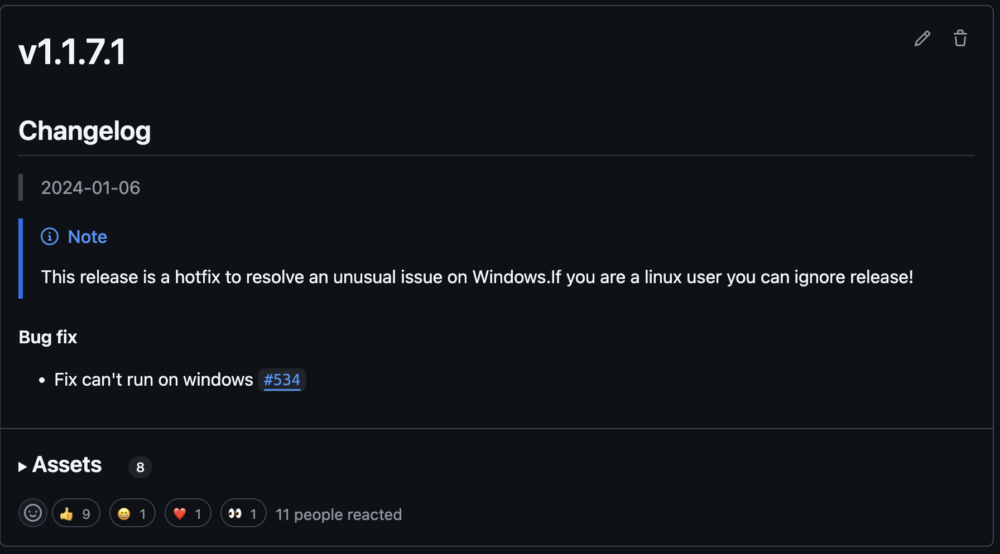

這篇文章主要會以我 superfile 中的經驗，來講解一下如果想要做一個 TUI 或者 CLI APP，你可能會需要知道的一些冷門知識以及規範。可以讓你在做這些 APP 的時候少走一些彎路。

# TUI 以及 CLI

## TUI (terminal user interfaces)

TUI 就是在 Terminal 上做出一個類似你平常使用的使用者介面，讓使用者可以控制你的 APP。這邊指的使用者介面一般都是以文字配合顏色來實現。

在操作部分，你可以使用鍵盤上的上下左右鍵，或者某個快捷鍵來觸發功能。有些較為現代的 TUI 程式甚至還支援滑鼠操作。

比方說，下面這個是我做的 superfile APP，它就是一個標準的 TUI APP，可以讓你在 Terminal 中透過 UI 介面執行檔案管理等功能。除此之外，各位熟知的 Vim 也是 TUI。


## CLI (Command-Line Interface)

CLI 是一個很早期就出現的互動方式（當時電腦還無法顯示圖形介面）。CLI 是透過打指令的方式來互動，無法像一般介面那樣用上下左右鍵操作。

指令通常會分成 command 和 options，而 command 有時還會包含 sub-command 或值。

舉例來說：
```bash
docker run -d -p 8080:80 --name my-nginx nginx
```

這裡面：

* `docker` 是程序名稱
* `run` 是 command
* `-d`、`-p 8080:80`、`--name my-nginx` 是 options
* `nginx` 是傳給 command 的值

下面這張圖是 docker（用 podman 示範）的範例畫面：


# 關於 TUI 以及 CLI 或者一些 APP 的知識

這段主要講一些 TUI 或 CLI APP 常見但不太被提到的小知識。雖然不是非常重要，但如果你想讓你的 APP 看起來像一個正經的軟體，還是建議你讀一下。不然可能會像我一樣被 HackerNews 上的人嘴 :/


## 默認資料夾（通用）

不管你是寫 CLI、TUI 還是其他型態的 APP，這都是通用的知識。

每個系統都有專屬放設定檔、log 檔的地方，並不是你想放哪就能亂放。原則上 Linux 遵循 [XDG](https://wiki.archlinux.org/title/XDG_Base_Directory) 規範，這雖然複雜，但對使用者來說是最好管理的方式。CLI 或 TUI 程式基本上都應該遵守這個。

而 macOS 和 Windows 的規範就比較鬆一點，下面這張表可以讓你快速對照：

| Purpose    | Linux                            | macOS                                           | Windows                          |
| ---------- | -------------------------------- | ----------------------------------------------- | -------------------------------- |
| **Data**   | `~/.local/share/{your_app_name}` | `~/Library/Application Support/{your_app_name}` | `%LOCALAPPDATA%\{your_app_name}` |
| **Log**    | `~/.local/state/{your_app_name}` | `~/Library/Application Support/{your_app_name}` | `%LOCALAPPDATA%\{your_app_name}` |
| **Config** | `~/.config/{your_app_name}`      | `~/Library/Application Support/{your_app_name}` | `%LOCALAPPDATA%\{your_app_name}` |

## 網路問題（CLI/TUI）

這問題多半是做 Linux/Unix 或比較極客領域才會遇到的，但我建議即便你不是做這方面的，也可以看一下。

原則上，只要你的程式能不連網就不要連。如果真的要連，也最好提供一個設定項讓使用者關閉它。

大多數 CLI/TUI 都不需要上網，除非你做的是像 curl 這種網路導向的工具。

像我的 superfile 是檔案管理器，理論上不該用網路，但因為有自動檢查更新的功能，所以我做了一個設定讓使用者可以控制它。最理想的做法其實是彈出一個提示視窗問使用者是否啟用自動更新。

## Release 的版本問題（通用）

當你完成了你的 APP 之後，可能就會開始宣傳並 release，讓其他人可以使用。而這時候你就要設定版本號了。

你可能會想亂設一個數字，但其實版本號不只是給人看的，它還會被各種 package manager（Homebrew、apt、snap、dnf 等）拿來解析。如果你亂設，可能會像我 superfile 那樣搞出一個 `1.1.7.1` 結果有些人抓不到更新（下圖）。

所以版本號建議一律使用 [Semantic Versioning](https://semver.org)，除非你有特殊理由。當然，有些語言或平台會有自己版本格式，那你就用那個就好。



# TUI 相關的東西

## Terminal 中是怎麼做到控制的

在 Terminal 中，當我們作為 APP 想要控制 terminal 顯示時，會使用所謂的 **ANSI escape sequences**。

例如：

* 全螢幕：`\033[?1049h`
* 改文字顏色：`\033[31m`

這樣我們就能改變 terminal 的外觀。

如果我們想偵測使用者輸入的鍵盤操作，就需要用 `raw mode` 來接收。例如按下 `A`，APP 會收到 `0x41`。

## Graph Protocol

你可能在 terminal 中看過可以顯示圖片的程式，這通常是透過所謂的 Graph Protocol 達成的。

目前主流的協定如下表（Terminal 很多都有做到多個協定的支持）：

| 協定名稱                   | 支援的 terminal（部分）         |
| ------------------------ | ---------------------------- |
| Kitty Graphics Protocol  | Kitty, WezTerm               |
| Sixel                    | xterm, mlterm, foot, WezTerm |
| iTerm2 Inline Images     | iTerm2                       |
| Terminology inline media | Terminology                  |
