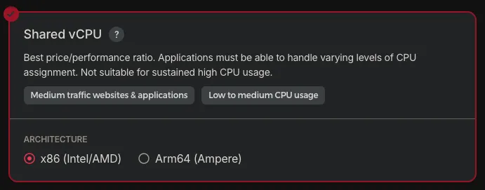
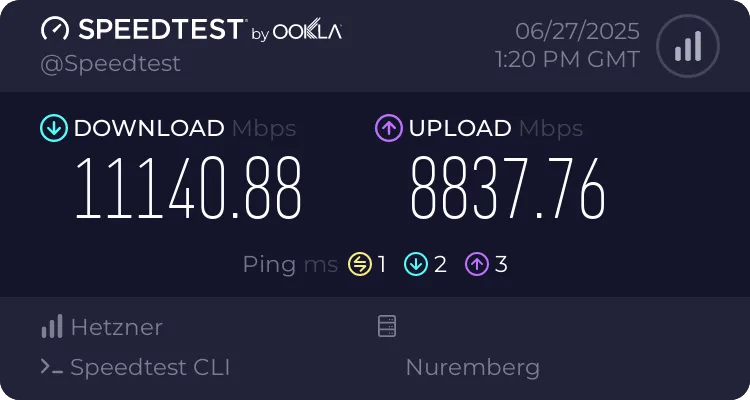
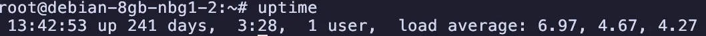
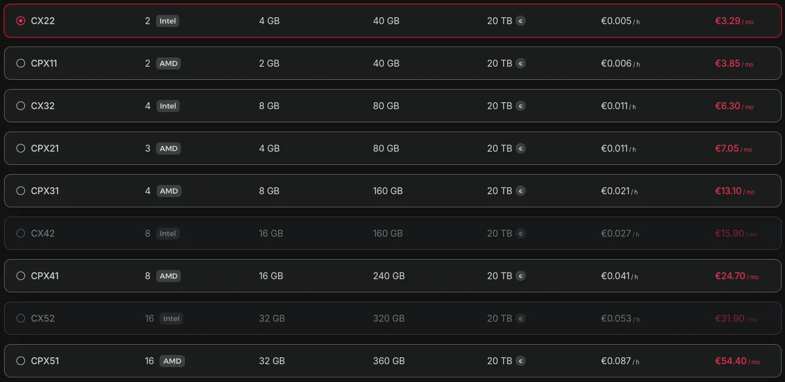
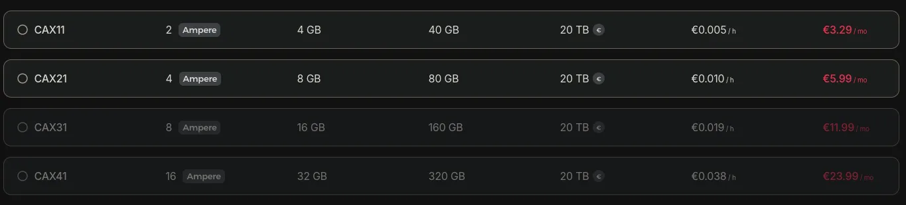

# 關於我使用 VPS 的經驗

大家好！今天想跟大家分享一下我使用 VPS 的經驗。因為我有一個叫做 MHCAT 的 Discord Bot，使用人數大概有一百萬人，所以需要一個穩定的 VPS 來運行它。

這隻 Bot 的程式碼在 [這裡](https://github.com/Yorukot/old-MHCAT)，有興趣的朋友可以去看看。

## 為什麼選擇 Hetzner？

我是一位窮學生，所以我嘗試了各種便宜的 VPS 來運行這隻 Bot，並簡單比較了最便宜和 CP 值最高的選擇。最終，我成為了 Hetzner 的忠實粉絲，從 2024 年開始使用他們的服務，到現在已經快兩年了。

### 我用過的 VPS 服務商

在選擇 Hetzner 之前，我其實試過不少家：
- **Hetzner** (目前主力)
- **DigitalOcean** (用過一陣子，但太貴了)
- **Vultr** (性能不錯，但 CP 值不如 Hetzner)
- **OVH Cloud** (法國的，延遲有點高)
- **Contabo** (德國的競爭對手，但穩定性較差)
- **Google Cloud** (免費額度用完就跑了 xD)

經過這麼多比較，Hetzner 確實在價格和性能上找到了很好的平衡點。

## Hetzner 的詳細體驗

### 性能表現

Hetzner 的性能我覺得跟 Google Cloud 差不多，主要提供 AMD、Intel 和 ARM 三種 CPU。我個人偏好 Intel，因為便宜，但聽說 AMD 的效能也不錯。ARM 的 CPU 便宜很多，效能稍差，但性價比很高。

我自己測試過幾種配置：
- **CAX11 (ARM)**: 2核4GB，跑我的 Discord Bot 綽綽有餘，Geekbench 跑分單核 1311，多核 1687
- **CX22 (Intel)**: 2核4GB，穩定性很好，適合長期運行的服務
- **CPX21 (AMD)**: 3核4GB，CPU 密集的任務表現不錯

### 網路速度

他們的網路速度非常快，基本上是 10G 的上傳和 9G 的下載，默認流量是 20TB，真的超划算！我實測在歐洲的機房可以跑到 1-2 Gbps，從台灣連過去延遲大概 200-300ms，對於我的 Bot 來說完全夠用。

### 穩定性表現

說到穩定性，我真的很滿意。看看這個 uptime，已經連續運行 241 天都沒有重開機了！這對於需要 24/7 運行的 Discord Bot 來說非常重要。

### 價格優勢

這是 Hetzner 最大的賣點！同樣的配置，比 DigitalOcean 便宜不知道多少：
- DigitalOcean: $24/月 → 4GB RAM + 2 vCPU + 4TB 流量
- Hetzner: €3.29/月 → 4GB RAM + 2 vCPU + 20TB 流量

這個差距實在太大了，對窮學生來說根本沒得選。

ARM 的方案更便宜，但需要考慮程式碼的相容性。

### 註冊體驗：德式嚴謹

老實說，註冊 Hetzner 比其他家麻煩很多。他們要求提供護照或身分證明文件，還要地址證明，整個驗證過程花了我兩天才完成。相比之下，DigitalOcean 或 Vultr 填個表就能開始用了。

但後來我理解這是德國公司的嚴謹作風，也是為了防止濫用。雖然麻煩，但確實過濾掉了很多惡意用戶。

### 客服體驗：專業且及時

Hetzner 的客服其實還不錯，雖然比較德式風格，但很專業。回覆也算及時（通常 24 小時內），遇到問題都能得到有效的解決。雖然態度沒有美國公司那種「客戶至上」的熱情，但實用性很高，直接給解決方案而不廢話。

### 技術特色

用了這麼久，我發現 Hetzner 有幾個很厲害的地方：

**自建基礎設施**：他們有自己的資料中心，硬體都是客製化的，這也是成本控制得這麼好的原因。

**頻寬政策**：20TB 的免費流量真的很佛心，我從來沒超過，即使 Bot 有一百萬用戶。

## 使用上的挑戰

### 地理位置限制

Hetzner 的機房主要在歐洲和美國，雖然最近有新加坡，但價格沒有優勢。對於亞洲用戶來說，延遲確實是個問題，不過對於我的 Discord Bot 來說還能接受。

### 服務範圍較窄

相比 DigitalOcean 或 AWS，Hetzner 的服務比較陽春：
- 沒有 Managed Database (要自己架 PostgreSQL)，但聽說最近要出來了。
- 沒有 Kubernetes 服務 (要用 Docker 自己搞)
- 沒有 CDN 服務 (要另外用 Cloudflare)

不過最近他們有新增一些服務：
- **Object Storage**：價格還算可以，但我還沒試過，應該跟 AWS S3 類似
- **Load Balancer / 反向代理**：對於需要高可用性的應用來說很實用

整體來說服務還是比較基本，對於複雜的應用可能需要搭配其他服務。

### 嚴格的使用政策

德國人真的很嚴格，他們對於：
- Port scanning
- 大量發信
- 挖礦
- 任何可疑活動

都是零容忍的。一被偵測到就可能被限制或關帳號，這點要特別注意。

## 適合誰使用？

**適合的情況：**
- 預算有限的個人開發者或學生
- 主要用戶在歐美地區
- 有基本的 Linux 管理能力
- 需要大量頻寬和儲存空間
- 不介意自己管理服務

**不適合的情況：**
- 需要全球多點部署
- 希望有完整的託管服務
- 對客服回應速度要求很高
- 習慣一鍵部署的便利性

## 總結

用了 Hetzner 快兩年，整體來說我很滿意。雖然有一些小問題，但 CP 值真的沒話說。對於像我這樣的窮學生來說，能用這個價格得到這樣的性能和穩定性，已經很滿足了。

如果你也在尋找便宜又穩定的 VPS，而且不介意自己動手管理的話，Hetzner 絕對值得試試！

最後提醒一下，註冊的時候記得準備好身分證明文件，耐心等待審核。一旦通過了，你就能享受到德國工藝的穩定和實惠了！

---

## 你都看到這邊了，如果有興趣的話，請使用[我的連結](https://hetzner.cloud/?ref=sNdQv6wHdiDR)註冊吧！這樣我也能獲得一些回饋，繼續維持我的 Discord Bot 跟網站運行 :)
