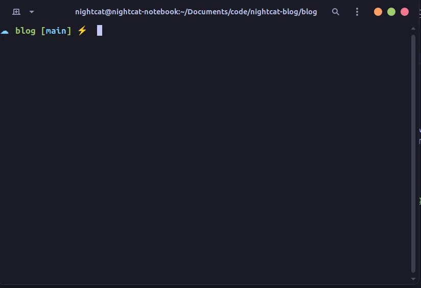

<Alert type="info">
因為這篇文章已經很老了，而且我找不到原始圖片，所以有些圖片是沒有的。
</Alert>

想要擁有像這樣的超帥終端機嗎？

那這篇文章就是為你量身打造的！

## 前言

- 系統環境是 Ubuntu 22.10，理論上其他系統也差不多可以這樣搞
- 示範是用 VirtualBox 做的
- 如果你之前因為安裝其他軟體已經跑過更新指令，可以直接跳到步驟 2
- 如果遇到問題，可以看看文章最後的疑難排解部分

# 安裝 Zsh 並打造專屬的 Oh My Zsh

## 步驟 1：更新整個系統

> 如果你之前因為安裝其他軟體已經執行過這個指令，可以直接跳到步驟 2

先讓系統套件保持最新狀態，輸入以下指令：

```bash
sudo apt install
```

完成後應該會看到類似這樣的畫面：


## 步驟 2：安裝 Zsh

在 Ubuntu 上安裝 Zsh 這個超強的 shell。

```bash
sudo apt install zsh
```

如果問你 (y/n)，直接打 y 然後按 Enter 就好。

### 確認 Zsh 安裝成功

檢查 Zsh 是否正確安裝，輸入：

```bash
zsh --version
```


## 步驟 3：安裝 Curl 和 Git

要下載 Oh My Zsh 的安裝檔案，需要先安裝 curl 和 git。輸入以下指令：

```bash
sudo apt install curl git
```

## 步驟 4：安裝 Oh My Zsh

Oh My Zsh 是一個讓 Zsh 變得更帥的套件。輸入以下指令來安裝：

```bash
sh -c "$(curl -fsSL https://raw.githubusercontent.com/ohmyzsh/ohmyzsh/master/tools/install.sh)"
```

當它問你的時候，按 y 就對了。

如果安裝成功，你應該會看到這個：


## 步驟 5：開始客製化你的 Zsh

現在你已經成功安裝 Zsh 了，可以開始打造專屬風格！

[**這裡有 Oh My Zsh 的官方主題列表**](https://github.com/ohmyzsh/ohmyzsh/wiki/Themes)

> 也有非官方的主題，但安裝比較複雜，這篇文章就不講了。

找到你喜歡的主題後，記下它的名字。比如說我喜歡這個，我就記住 "cloud"。


接下來輸入這個指令：

```bash
nano ~/.zshrc
```

你會看到一個看起來有點嚇人的畫面，但其實不難！


首先，找到 `ZSH_THEME="rubbyrussell"` 這行，把它改成你想要的主題名稱。

用 cloud 主題當例子，就是：

`ZSH_THEME="cloud"`

改完後，按 `ctrl+x` + `y` + `enter` 來儲存！

要重新載入 Zsh，可以輸入：

```bash
source ~/.zshrc
```

完成後，你應該就能看到它變成你選的主題了！

# 終端機顏色主題

## 步驟 6：安裝必要的套件

現在可以開始客製化顏色了。這裡我們建議使用別人已經調好的主題。

> [我們會使用這個主題包](https://github.com/Gogh-Co/Gogh)

安裝必要的套件，輸入：

```bash
sudo apt-get install dconf-cli uuid-runtime
```

## 步驟 7：安裝主題包

安裝主題包，輸入：

```bash
bash -c "$(wget -qO- https://git.io/vQgMr)"
```

它會顯示各種符號和英文，一個符號加英文代表一個主題。你可以上網搜尋你想要的主題名稱，或是自己探索看看。

假設我想用 "Tokyo Night" 這個主題：


那我就輸入 `230`（如圖所示）：


然後按 `enter`。

> 如果遇到這個錯誤，請看下面的疑難排解。

## 步驟 8：套用主題

首先，右鍵點擊終端機，點選 `Preferences`。


然後在你剛才選的主題名稱旁邊點 `Set as default`。


關掉終端機再重新開啟，就能看到主題效果了。

但你可能會發現 Zsh 主題不見了，這是因為 Zsh 還不是你的預設 shell。下一節會教你怎麼把它設成預設。


## 步驟 9：把 Zsh 設為預設

首先，進入 Preferences，點選你剛才設定的主題。


然後點選上方的 `command`，勾選 `Run a custom command instead of my shell`，在下面的輸入欄位輸入 zsh（如下圖所示）。


# 完成！

搞定！你現在已經成功設定好 GNOME 終端機主題了！

要達到文章開頭圖片的效果，你還需要設定 GNOME 主題（這個以後可能會寫文章介紹！）。

# 疑難排解

## 安裝主題包時出現錯誤

右鍵點擊終端機，點選 Preferences。


開啟視窗後，點選 `Profiles` 旁邊的 `+`，輸入 `Default`（其他都不用改）。


完成後，重複步驟 7。
