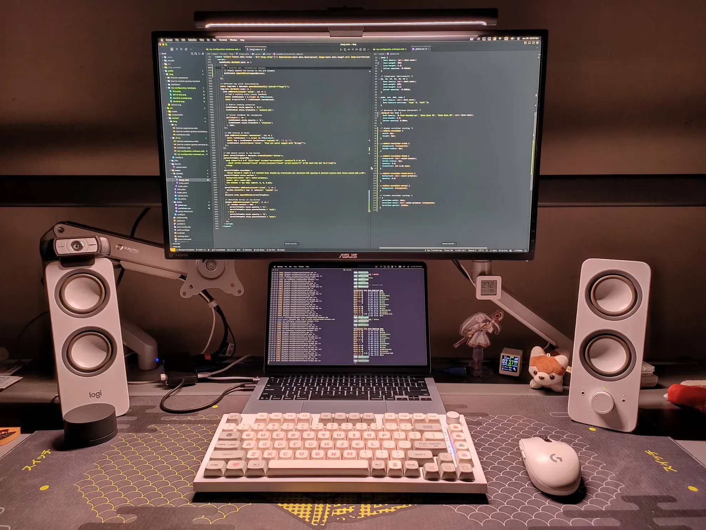

這篇文章主要會說一些關於我目前的硬體配置，包括電腦、螢幕、喇叭等。

這其實是兩篇文章，一篇是我的硬體，一篇是軟體，這邊是講硬體的，你可以[點我](/zh-tw/blog/my-configuration-software/)到軟體

這邊先放一張高清的 Desk setup （這幾乎是沒有整理過的樣子）

如果你覺得裡面的任何設置很棒歡迎直接抄過去使用～

# 電腦 - Macbook air M4

我目前的電腦是 Macbook air M4，配置的話是：

- **儲存空間**：512GB
- **記憶體**：16GB

# 筆電包 - Tomtoc

Tomtoc 的一個電腦包，~~覺得他的顏值很高~~，用了一陣子目前用起來的感覺是真的蠻好用的，裡面的保護看起來是真的摔了也不會壞，除了貴了一點點外目前沒有遇到任何的問題。

[點我前往](https://www.tomtoc.com.tw/a14b02h-13mbp2016)

# 螢幕 - TUF Gaming VG27AQ HDR

螢幕目前是 TUF Gaming VG27AQ HDR，直接說結論，這個螢幕超級爛，對我是說超級，貴又不好用。如果你要買螢幕的話完全不推薦這個螢幕，建議可以考慮其他品牌的。

[點我前往](https://www.asus.com/tw/displays-desktops/monitors/tuf-gaming/tuf-gaming-vg27aq/)

# 螢幕支架 - Raymii LS40

這個支架個人認為有點太短了，沒有辦法把螢幕打直（雖然我不需要），除此之外沒有什麼太大的問題，自己買了兩個一個放螢幕，一個放筆電不過因為 Macbook 我是直接放在桌上的所以目前這個支架被閒置了。

[點我前往](https://store.raymii.com.tw/products/raymii-ls40-aluminum-monitor-arm)

# 螢幕掛燈 - 米家螢幕掛燈

螢幕掛燈這東西非常的好用，他可以說是我目前的剛需。因為我其實是睡在雙層床的（下面是書桌）。所以需要一盞燈去做照明。但普通的燈都會有反光或者太亮的問題，所以就買了這個東西。

## 使用體驗

非常完美。我會跟任何用電腦的人推薦這個東西，從 2022 到現在還在用，耐用性應該非常完美。

## 價格優勢

也比隔壁家的 BenQ 便宜不知道多少，只比一般的檯燈貴一點。

## 唯一缺點

大概是他的亮度跟範圍小小不足。

[點我前往](https://www.mi.com/tw/product/mi-computer-monitor-light-bar/)

# 鍵盤 - 客製化鍵盤

鍵盤的部分是客製化鍵盤，身為前鍵盤發燒友，我應該在鍵盤上花了也快要一萬了。

曾經買了各種工具來客製化鍵盤，鍵盤裡面還要放一元硬幣，到現在再用 Macbook 的鍵盤當主力真的很諷刺。

目前基本上只有玩遊戲跟偶爾會想聽一下這個真的很好聽的機械鍵盤聲音外很少用它了。

這邊就只寫我最後的退燒之作了：

## 配置規格

- **軸體**：LEOBOG 灰木軸 V3
- **套件**：KW75S
- **鍵帽**：任天堂主題的不知名鍵帽
- **大鍵鋼絲潤滑**：22058
- **軸體潤滑**：GPL 105 + 205 MIX
- **彈簧潤滑**：GPL 105
- **其他**：底部放了吸音棉，PCB 層的部分有用醫用布膠帶去做處理，最後底部份了快要100個一塊錢，所以這台重到可以打人。

## 影片介紹

另外我有拍一個影片是關於這把鍵盤的就放在這邊了：

<iframe
  src="https://www.youtube.com/embed/4iQG4aDgDxE"
  allowfullscreen/>

# 滑鼠 - Logitech G304

這個滑鼠用了快要 3 年了，基本上我其實沒有到很喜歡，但就將就著用，而且換成 Macbook 之後我使用滑鼠的時間大幅度下降。

## 主要缺點

- 需要換電池，經常用著用著就沒電了
- 用久之後似乎磨沙層被磨掉了，非常容易打油，用個幾分鐘就要擦一下

[點我前往](https://store.logitech.tw/products/g304)

# 喇叭 - Logitech Z2000

喇叭部分，我自己雖然有一點研究音響相關的東西，但是我自認為我是一個木耳，老實講聽不太出來有什麼區別，個人認為這個喇叭還算是可以，目前沒有遇到什麼太大的問題。

[點我前往](https://store.logitech.tw/products/z200-多媒體音箱2色)

# 耳罩耳機 - ROG STRIX GO 3.5mm

耳罩耳機的部分我是之前在蝦皮上逛到有人以蠻低的價格在賣這台，所以就買了。

## 使用評價

- **音質**：他的音質蠻糟糕的（聽的出來的糟糕）
- **麥克風**：至於麥克風的部分我其實不常用所以就不予置評了

如果你在考慮耳機的話我非常不建議這台，但他還是陪我到現在也快 3 年了。

[點我前往](https://rog.asus.com/tw/headsets-audio/headsets/3-5mm-headsets/rog-strix-go-core-model/)

# 藍芽入耳式耳機 - Liberty 4 NC

藍芽入耳式耳機這東西我自己用了非常多付（應該至少有 7 副左右），對這東西還算是有點經驗。這台的部分我老實講認為不是最好的。

## 詳細評價

- **音質**：音質部份我認為非常不錯。但音質很憑個人，建議可以找個現場試聽
- **降噪**：這台主打的其實是降噪，僅次於旗艦的降噪。我對降噪其實沒有這麼追求，對他的感受就是能用沒有太多評價
- **舒適度**：舒適度部分必須說我覺得蠻爛的，可能我自己的耳型不適合，經常戴著就鬆了，甚至會掉的那種
- **續航**：續航非常好，應該算是我用過這麼多耳機裡面最好的了，我可以從早上 7 點連著到晚上還有電，雖然沒有一直播放就是了

整體來講我覺得還不錯，但如果你想買的話我首推不會是這台就是了。

[點我前往](https://www.soundcore.com.tw/products/liberty-4-nc?)

# 麥克風 - RAZER Seiren Mini

這個麥克風應該也用了至少 3 年了，整體來講我覺得不錯，會推給其他人的那種。

## 使用評價

- **音質**：音質部分我認為還算是符合我的聲線，整體來說也沒有太多的雜音
- **實用性**：這台我要說的話唯一的缺點就是他沒有給一個實體的靜音按鈕。覺得應該要加上（新版有了）

## 總結

這個麥克風非常好，對的起他的價格，如果你要買的話我會推薦 V3，多了一個實體按鈕可以去做靜音，不要小看這個功能，這功能非常好用，軟體靜音跟實體的靜音絕對是實體靜音，尤其當你隨時會被 Gank 的時候。

[點我前往](https://www.razer.com/mena-en/streaming-microphones/razer-seiren-mini)

# 手機 - Oppo Reno5

痾，這台手機用了有一段時間了，簡單來講就是不會當機，我一般的需求都能滿足。但我**絕對**不推薦你買這個東西（比耳罩耳機更不推薦）。

當初買大概 12000 左右，最近有點想換 Google Pixel。

btw 這台他最近的更新連官方軟體都有廣告，我真的服了。

[點我前往](https://www.oppo.com/tw/smartphones/series-reno/reno5/specs)

---

硬體部分大概介紹到這邊，如果你覺得我還有什麼可以介紹讓你認識一下的話，歡迎下面留言。
