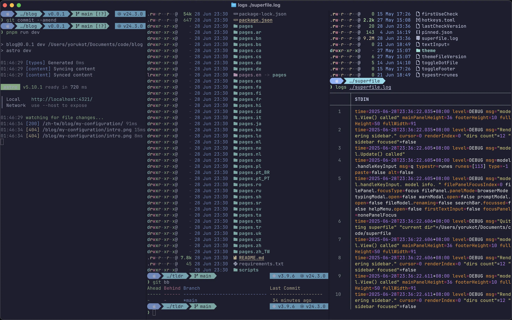
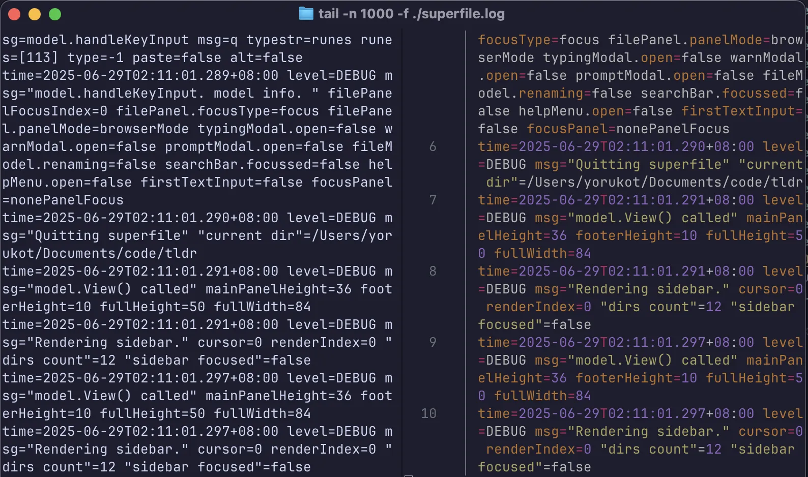
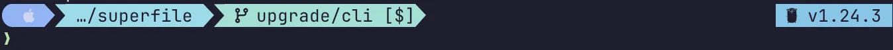

這篇文章主要會說一些關於我目前的軟體配置，因為軟體配置實在太多了，所以可能沒辦法每個都寫到，就有想到就慢慢補或者你可以留言詢問。

這其實是兩篇文章，一篇是我的軟體，一篇是硬體，這邊是講軟體的，你可以[點我](/zh-tw/blog/my-configuration-hardware)到硬體

如果你覺得裡面的任何設置很棒歡迎直接抄過去使用～

# Terminal 相關

首先是展示一下我的 Terminal 最後大概看起來長怎樣



## Terminal emulator - Ghostty

已經用了一陣子的 Terminal emulator （以下簡稱 terminal），這個 terminal 的特點主要就是用 Zig 寫的，速度聽說很快還可以用 GPU 渲染，但反正我是感受不到什麼區別。

這個 terminal 是從 2020 開始的 idea 主要是希望寫一個為現代打造的 terminal 網路上的評價還不錯，我用起來的感覺也非常的好。

他還支援蠻多 terminal 的 protocol 比如 Kitty graphics protocol。

下面是我的 config file，我自己其實沒有做太多了的設定，因為不太需要，但他似乎有蠻多很棒的設定的你可以去文檔看看。

```toml
theme = catppuccin-mocha

font-family = "JetBrains Mono NL"
```

## Shell - Zsh

Shell 的部分是用 Zsh 從我用 Linux 到 MacOS 都是用它，其實沒有認真嘗試過其他的 Shell 但反正用習慣了，目前也不打算改。

下麵是我的 Zsh 相關設定，插件的部分記得要去安裝，可以上網 Google 一下要怎麼安裝

```bash
# ===============================
# Path to your Oh My Zsh install
# ===============================
export ZSH="$HOME/.oh-my-zsh"

# ===============================
# Plugins (Oh My Zsh will load them)
# ===============================
plugins=(
  git
  zsh-autosuggestions
  zsh-syntax-highlighting
  sudo
  extract
  zsh-bat
)

# Load Oh My Zsh
source $ZSH/oh-my-zsh.sh

# ===============================
# Starship prompt (must come AFTER Oh My Zsh)
# ===============================
eval "$(starship init zsh)"

# ===============================
# Custom environment variables (optional)
# ===============================
[ -f "$HOME/.local/bin/env" ] && source "$HOME/.local/bin/env"

# ===============================
# Podman & Docker compatibility
# ===============================
# Add Podman to PATH
export PATH="/opt/podman/bin:$PATH"
# Alias Docker command to use Podman
alias docker=podman

# ===============================
# Conda initialization (auto-generated)
# ===============================
__conda_setup="$('/Users/yorukot/miniconda3/bin/conda' 'shell.zsh' 'hook' 2> /dev/null)"
if [ $? -eq 0 ]; then
    eval "$__conda_setup"
elif [ -f "/Users/yorukot/miniconda3/etc/profile.d/conda.sh" ]; then
    source "/Users/yorukot/miniconda3/etc/profile.d/conda.sh"
else
    export PATH="/Users/yorukot/miniconda3/bin:$PATH"
fi
unset __conda_setup

# ===============================
# FZF initialization
# ===============================
[ -f ~/.fzf.zsh ] && source ~/.fzf.zsh

# ===============================
# vim alias
# ===============================
alias vim=nvim

# ===============================
# Golang
# ===============================
export PATH="$HOME/go/bin:$PATH"

# ===============================
# git
# ===============================
export VISUAL=nvim
export EDITOR=nvim

# ===============================
# Rust
# ===============================
. "$HOME/.cargo/env"

# ===============================
# Zoxide
# ===============================
eval "$(zoxide init zsh)"

# ===============================
# exa (eza)
# ===============================
alias ls='eza --icons -lh --no-user'

# ===============================
# bun
# ===============================
[ -s "/Users/yorukot/.bun/_bun" ] && source "/Users/yorukot/.bun/_bun"

export BUN_INSTALL="$HOME/.bun"
export PATH="$BUN_INSTALL/bin:$PATH"

# ===============================
# Bat with tail
# ===============================
logs() {
  if [[ -z "$1" ]]; then
    echo "error: Please specify a log file."
    return 1
  fi

  tail -f "$1" | bat --paging=never -l log
}
```

### 複雜函數設定說明

這邊主要講一下我比較複雜的函數設定:

- `logs` - 這個主要就是在把 tail 變成經過 bat format 過的效果，這樣看起來比較舒服。你可以看看下面這張發現區別（右邊是 logs 左邊是一般 tail）



## Terminal Prompt - Starship

如果你在上面 Shell 的部分有認真看我的配置的話應該有發現我是用 Starship 做 terminal prompt 的。

Starship 是一個很快的 terminal prompt，那什麼是 terminal prompt 呢？簡單來說就是會讓你的 terminal 顯示出下面這種東西的東西。



下面是我的 Starship 設定，其實就是一些很基本的東西沒什麼好說的。有興趣可以去查 Starship 文檔來看。

```toml
"$schema" = 'https://starship.rs/config-schema.json'

format = """
[](fg:nord10 bg:none)[  ](bg:nord10 fg:nord4)[](fg:nord10 bg:none)\
$conda\
$docker_context\
$directory\
$package\
$git_branch\
$git_status\
${custom.git_end}\
$cmd_duration\
$fill\
${custom.prog_ver_start}\
$python$nodejs$java$golang\
${custom.prog_ver_end}\
$line_break\
$character
"""

add_newline = false
palette = 'nord'

[custom.prog_ver_start]
style = "fg:nord9 bg:none"
symbol = ""
detect_files = ["pyproject.toml", ".python-version"]


[custom.prog_ver_end]
style = "fg:nord9 bg:none"
symbol = ""
detect_files = ["pyproject.toml", ".python-version"]

[cmd_duration]
style = "fg:nord9 bg:none"
format = "[]($style)[ $duration ](fg:nord0 bg:nord9)[]($style)"

[directory]
style = "fg:nord8 bg:none"
format = "[]($style)[ $path ](fg:nord0 bg:nord8)[]($style)"
truncation_length = 1
truncation_symbol = "…/"

# Here is how you can shorten some long paths by text replacement
# similar to mapped_locations in Oh My Posh:
[directory.substitutions]
"Documents" = "󱔘"
"Downloads" = " "
"Music" = " "
"Pictures" = " "
# Keep in mind that the order matters. For example:
# "Important Documents" = "  "
# will not be replaced, because "Documents" was already substituted before.
# So either put "Important Documents" before "Documents" or use the substituted version:
# "Important  " = "  "

[fill]
symbol = " "

[conda]
style = "fg:nord15 bg:none"
format = "[]($style)[ conda $environment ](fg:nord0 bg:nord15)[]($style)"

[docker_context]
style = "fg:nord15 bg:none"
format = "[]($style)[ docker $environment ](fg:nord0 bg:nord15)[]($style)"

[package]
style = "fg:nord9 bg:none"
format = "[]($style)[ $version ](fg:nord0 bg:nord9)[]($style)"

[git_branch]
symbol = ""
style = "fg:nord0 bg:nord7"
format = '[](fg:nord7 bg:none)[ $symbol $branch ]($style)'

[git_status]
style = "fg:nord0 bg:nord7"
format = '([\[$all_status$ahead_behind\]]($style))'

[custom.git_end]
style = "fg:nord7 bg:none"
symbol = ""
when = "git status 2>/dev/null; echo $?"
require_repo = true

[python]
symbol = ""
style = "fg:nord0 bg:nord9"
format = '[ [$symbol](fg:nord4 bg:nord9) $version ]($style)'

[golang]
symbol = ""
style = "fg:nord0 bg:nord9"
format = '[ $symbol $version ]($style)'

[nodejs]
symbol = ""
style = "fg:nord0 bg:nord9"
format = '[ $symbol $version ]($style)'

[palettes.nord]
nord0 = "#1E1E2E"  # base
nord1 = "#181825"  # mantle
nord2 = "#313244"  # surface0
nord3 = "#45475A"  # surface1
nord4 = "#CDD6F4"  # text
nord5 = "#F5E0DC"  # rosewater
nord6 = "#F2CDCD"  # flamingo
nord7 = "#94E2D5"  # teal
nord8 = "#89DCEB"  # sky
nord9 = "#74C7EC"  # sapphire
nord10 = "#89B4FA" # blue
nord11 = "#F38BA8" # red
nord12 = "#FAB387" # peach
nord13 = "#F9E2AF" # yellow
nord14 = "#A6E3A1" # green
nord15 = "#CBA6F7" # mauve

[container]
disabled = true
```

---

> 其實還有很多可以寫的，但暫時就先寫到這，未來可能會加更多東西
