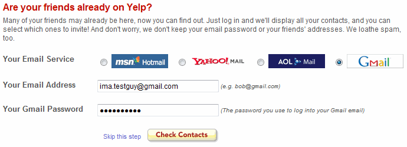

這篇文章會說明 OAuth 的基本概念，這是一個我個人的學習筆記，但基本上應該會盡可能的正確，歡迎把它拿來當作學習用的資源。

# 為什麼需要 OAuth

在 OAuth 之前當我們需要做到取得像是 Google 或者是 Facebook 的資源的話，我們一般要做的事情是像下圖 Yelp 做的一樣我們需要使用者把自己的 Email 和 Password 給第三方在由第三方去取得資源。

這個做法在現在來講非常的爛，但他確實曾經存在過，而即便大多數公司都說不應該這樣做，但使用者們只是想要達到聯繫可能在 Facebook 上的好友而已，根本不會在乎這麼多資訊安全的問題。

因此在這樣的背景下，OAuth 在 2006 年時被 X (前身 Twitter) 的工程師 Blaine Cook 所提出作為初始的構想，而後位於 Google 工作的 DeWitt Clinton 也加入了討論，在之後 Eran Hammer 也加入了討論並且對 OAuth 草稿產生的強大的影響力。

在多次討論之後這篇草稿被送往 IETF 並在 2010 年發布成爲了 [RFC 5894](https://datatracker.ietf.org/doc/html/rfc5849)，而在兩年之後（2012 年）在收集了開發者們的反饋之後 OAuth 2.0 誕生了並且由於他在改進後的可實現性以及安全性皆大大提升（但還是有安全性問題），所以很快的被各大公司所採用。

而因為 OAuth 1.0 使用的人實際上非常少，目前也基本滅絕了，所以以下的 OAuth 皆代表 OAuth 2.0。

然後接著因為 OAuth 的使用過於廣泛，並且之後還有一些安全性問題，後來接續推出了很多的 "OAuth Plugin" RFC 來增強 OAuth 的廣泛使用性（如下面那張圖顯示的複雜性）。這個系列後面會在提到更多的細節。

> 圖片來源: McGovern, L. (2019). OAuth 2.1: How many RFCs does it take to change a lightbulb? Retrieved from

順帶一題 OAuth 2.1 正在草稿中，如果你有興趣歡迎到 https://events.oauth.net 看看。

# OAuth 2.0
